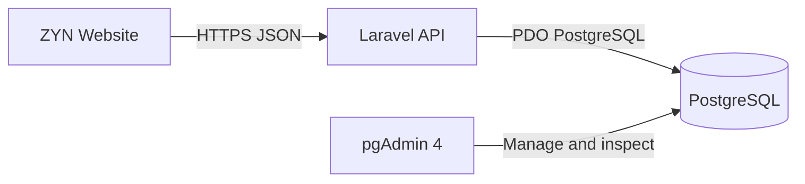

# ZYN Store Laravel Backend

Laravel 12 REST API for the existing ZYN Reserve Cambodia storefront. It uses
PostgreSQL as the database and pgAdmin 4 as the database-management interface.



## Included

- Public products API
- Secure order creation with server-side totals
- PostgreSQL transactions and row locking
- Stock control
- Product image upload
- ABA/KHQR, ABA PayWay, and cash-on-delivery payment records
- Laravel Sanctum admin tokens
- Admin product and order APIs
- 21+ confirmation stored on each order
- Six seeded catalog cards; only Cool Mint is orderable by default at `$4.00`
- Feature tests for products, orders, stock, and admin authentication
- Khmer pgAdmin 4 setup guide

## Database tables

| Table | Purpose |
| --- | --- |
| `products` | Product, strength, price, photo, status, stock |
| `orders` | Customer, delivery, payment choice, status, totals |
| `order_items` | Immutable product/price snapshot for each order |
| `payments` | Payment status and transaction reference |
| `users` | Admin accounts |
| `personal_access_tokens` | Admin API tokens |

## Windows quick start

Requirements:

- PHP 8.2+
- Composer 2
- PostgreSQL and pgAdmin 4
- PHP extensions `pdo_pgsql` and `pgsql`

### 1. Create the database

Create `zyn_store` in pgAdmin 4. Full Khmer instructions:
[docs/PGADMIN_SETUP_KH.md](docs/PGADMIN_SETUP_KH.md).

### 2. Prepare Laravel

Open PowerShell inside this folder:

```powershell
powershell -ExecutionPolicy Bypass -File .\setup-windows.ps1
```

Or run manually:

```powershell
copy .env.example .env
composer install
php artisan key:generate
```

### 3. Configure `.env`

Set the real PostgreSQL password and your new admin credentials:

```env
DB_DATABASE=zyn_store
DB_USERNAME=postgres
DB_PASSWORD=YOUR_POSTGRES_PASSWORD

ADMIN_EMAIL=your-email@example.com
ADMIN_PASSWORD=USE-A-STRONG-UNIQUE-PASSWORD
```

Never commit or share `.env`.

### 4. Create tables and start

```powershell
php artisan migrate --seed
php artisan storage:link
php artisan serve
```

Check:

- `http://127.0.0.1:8000/api/health`
- `http://127.0.0.1:8000/api/products`

### 5. Run tests

```powershell
php artisan test
```

## Project structure

```text
app/
  Enums/                    Product, order, and payment states
  Http/Controllers/Api/     Public and protected API controllers
  Http/Requests/            Validation and authorization
  Http/Resources/           Stable JSON response shapes
  Models/                   Eloquent models and relationships
  Services/OrderService.php Transaction-safe order creation
config/                     PostgreSQL, CORS, auth, store settings
database/
  factories/                Test data
  migrations/               PostgreSQL table definitions
  seeders/                  Cool Mint and sample catalog
  sql/                      Optional pgAdmin database creation SQL
docs/                       pgAdmin, API, and frontend guides
frontend-example/           Next.js API client example
routes/api.php              Public and admin endpoints
tests/Feature/              API behavior tests
```

## Important business rules

- Browser-supplied prices are never trusted.
- Money is stored as integer cents (`$4.00` → `400`).
- Sample/draft/inactive products cannot be ordered.
- Order items keep product name, strength, and price snapshots.
- Stock and the order are updated in one database transaction.
- Payment starts as `pending`; the admin confirms it after receiving payment.

See [docs/API.md](docs/API.md) for request examples and
[docs/FRONTEND_INTEGRATION.md](docs/FRONTEND_INTEGRATION.md) for connecting the
current storefront.
